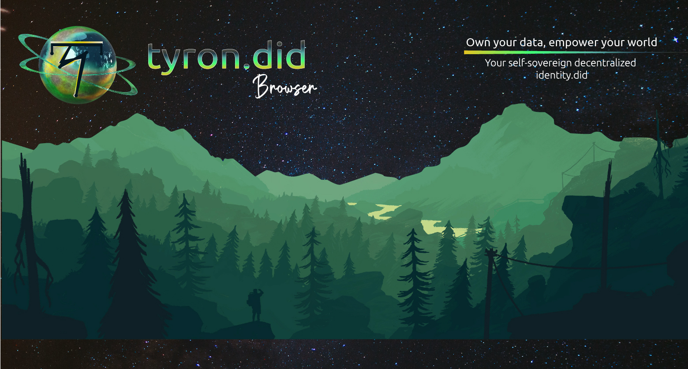

Self-sovereign digital identity decentralized application on the Zilliqa blockchain platform.

Open-source dApp for the web browser, iOS and Android.

Mainly built with:
- [Tyron DID SDK](https://github.com/pungtas/tyronzil-sdk) which integrates [Zilliqa's SDK](https://github.com/Zilliqa/Zilliqa-JavaScript-Library)
- [Expo](https://duckduckgo.com/?q=expo%20react%20native+site:expo.io&t=canonical), [React Native](https://reactnative.dev/) & [React Navigation](https://reactnavigation.org/)

The tyron.did dApp implements the Tyron SSI Protocol that is based on smart-contract technology to solve the issue of DID scalability, describing the [W3C tyronzil DID-Method](https://www.tyronzil.com) and the cryptographic information to instantiate, deploy and manage the DID smart contract ([did.tyron](https://www.tyronzil.com/smart-contracts/didc/)) that has the user as its owner. 

With tyron, the user is in control of their self-sovereign identity and must be the caller to every tyronzil transaction, for the didc.tyron smart contract to be functional.

## Tyron

Self-Sovereign Identity (SSI) allows people to manage their digital identities, proving who they are without a middleman, by anchoring DIDs on blockchain platforms as a shared root of trust. However, most blockchains still can't provide decentralized identity at scale. By implementing the Tyron SSI Protocol, we aim to solve this issue and enable user-controlled digital identities.

The word Tyron derives from the Greek *turannos* that means sovereign, and **Tyron's purpose is to give people sovereignty over their data**.

## Use cases

Self-sovereign identity technologies are key for human-economic development.

Tyron gives stakeholders of the Zilliqa blockchain platform and broader crypto space an entity that is much more than an address. With Scilla smart contracts, the digital identity can show public information such as services provided by the user (websites, cryptocurrency addresses) as well as showing the cryptographic public keys to engage in encrypted DID communication and verify signatures in W3C credentials.

Stakeholders such as stakers, operators, financial companies (stablecoins & exchanges) and dApps can benefit from tyron's SSI account system and empower their users through integrations with, e.g. zilswap.

## Contributing

It'd be great to have your help! Please refer to the [contributing guideline](./CONTRIBUTING.md) and [code of conduct](./CODE_OF_CONDUCT.md) :zap:
